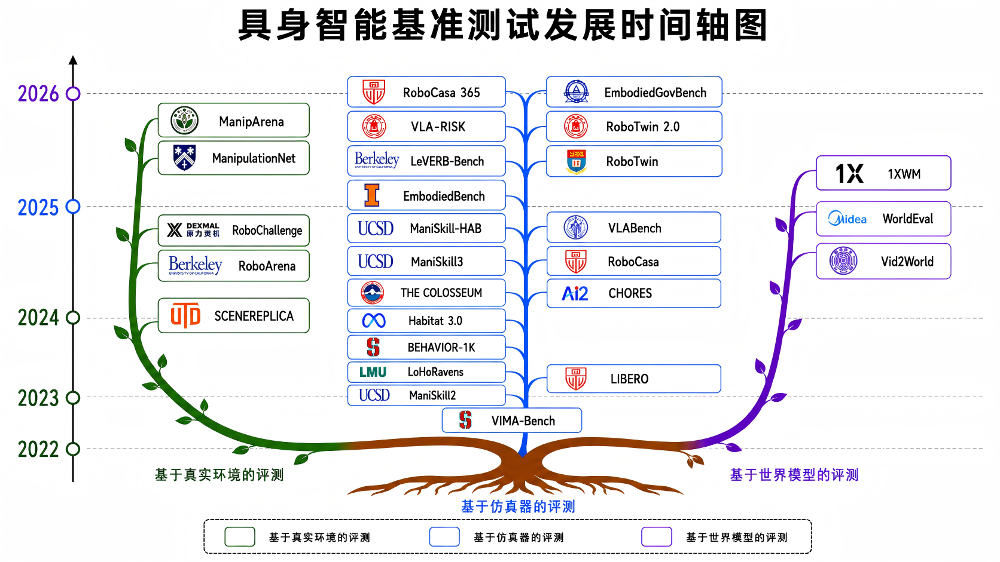

# **Embodied AI & Robotics Benchmarks**

系统性梳理和追踪**具身智能（Embodied AI）与机器人**领域的基准测试（Benchmarks）与评测平台。  

> 🏛️ **组织与维护 (Maintained by):** CAICT EAIBench Team  
> 🎯 **收录范围 (Scope):** 真实环境评测 (Real-world) + 仿真器 (Simulation) + 世界模型 (World Models)

---

## 🤖 具身智能基准测试发展时间轴图

---

## 🏷️ 标签说明 / Tag Legend
| 分类维度 / Category | 包含标签与定义说明 / Badges & Descriptions |
| :--- | :--- |
| **环境类型** Environment | 🔹  **Real-world:** 真实场景物理部署 &nbsp;&nbsp;&nbsp;&nbsp; 🔹  **Simulation:** 纯虚拟仿真环境评测底座 🔹  **World Model:** 基于视频/世界模型的交互推演 |
| **任务类型** Task | 🔹  **Manipulation:** 机械臂抓取/对刀等操控任务 &nbsp;&nbsp;&nbsp;&nbsp; 🔹  **Navigation:** 移动底盘自主导航/路径规划 🔹  **Mobile Mani.:** 移动复合机器人大范围操作 &nbsp;&nbsp;&nbsp;&nbsp; 🔹  **Safety:** 鲁棒性、社会治理与合规安全风险评估 |
| **任务跨度与场景** Horizon & Scene | 🔹  **Short-horizon:** 短视距单技能原子任务 &nbsp;&nbsp;&nbsp;&nbsp; 🔹  **Long-horizon:** 长程多阶复合长视野任务 🔹  **Tabletop:** 紧凑型桌面级操纵环境 &nbsp;&nbsp;&nbsp;&nbsp; 🔹  **Household:** 室内居家/厨房家务真实场景 🔹  **Multi-scene:** 跨领域大规模多异构场景 &nbsp;&nbsp;&nbsp;&nbsp; 🔹  **Open-world:** 野外/开放式非结构化真实环境 |
| **数据模态** Modality | 🔹  **RGB:** 纯视觉相机图像观测 &nbsp;&nbsp;&nbsp;&nbsp; 🔹  **Depth:** RGB-D / 点云深度空间信息 &nbsp;&nbsp;&nbsp;&nbsp; 🔹  **Language:** 自然语言指令/提示词 🔹  **Trajectory:** 专家演示轨迹/动作数据 &nbsp;&nbsp;&nbsp;&nbsp; 🔹  **Video:** 视频流/生成的自回归视频帧 &nbsp;&nbsp;&nbsp;&nbsp; 🔹  **Tactile:** 力觉/触觉反馈信号 |

---

## 🌍 真实场景评测 (Real-World Evaluation)

针对真实物理环境中机器人操作、推理与泛化能力的基准测试。近年来越来越注重规模化和复杂推理能力。由于硬件搭建与数据收集成本较高，发布时间相对较晚，且多采用软硬件结合的挑战赛形式释出。

### 🔹 **[SCENEREPLICA](https://ieeexplore.ieee.org/abstract/document/10610180/)** (ICRA 2024)
* **论文题目 / Title:** SceneReplica: Benchmarking Real-World Robot Manipulation by Creating Replicable Scenes
* **单位 / Institution:** 得克萨斯大学达拉斯分校 (UT Dallas)
* **属性 / Badges:**    
* **硬件平台 / Platform:** Fetch 移动操作臂 (Fetch Mobile Manipulator)
* **规模特点 / Detail:** 聚焦于**桌面操作场景**下的抓取和放置（Grasp and Place）任务，共包含 20 个可重复构建的实体机械臂操作任务。

### 🔹 **[RoboArena](https://arxiv.org/abs/2506.18123)** (CoRL 2025)
* **论文题目 / Title:** RoboArena: A Distributed Framework for Real-World Evaluation of Generalist Robot Policies
* **单位 / Institution:** 加州大学伯克利分校 (UC Berkeley)
* **属性 / Badges:**    
* **硬件平台 / Platform:** DROID 机器人平台 (DROID Robot Platform)
* **规模特点 / Detail:** 针对非结构化的**开放真实环境**设计，提供了一套分布式评估框架。任务规模处于**持续扩展**状态，旨在对通用型机器人策略进行大范围的物理表现度量。

### 🔹 **[RoboChallenge](https://arxiv.org/abs/2510.17950)** (arXiv 2025)
* **论文题目 / Title:** RoboChallenge: An Open Large-Scale Remote Evaluation Benchmark for Embodied AI Models
* **单位 / Institution:** Dexmal 原力灵机
* **属性 / Badges:**    
* **硬件平台 / Platform:** ARX5 / UR5 / UR5e / ALOHA / Franka 等多机型跨平台支持
* **规模特点 / Detail:** 针对**桌面操作场景**进行的大大规模物理评测，提供 30 个标准的桌面原子操纵任务，支持社区主流的异构本体进行远程或本地基准对接。

### 🔹 **[ManipulationNet](https://arxiv.org/abs/2603.04363)** (arXiv 2026)
* **论文题目 / Title:** ManipulationNet: An Infrastructure for Benchmarking Real-World Robot Manipulation with Physical Skill Challenges and Embodied Multimodal Reasoning
*  **单位 / Institution:** 莱斯大学 (Rice University)
* **属性 / Badges:**  
* **规模特点 / Detail:** 聚焦于**通用操作场景**下的规模化机器人操控基准评估。基准包含 100+ 核心交互任务，并伴随物理技能挑战与实体推理需求**持续扩展**。

### 🔹 **[ManipArena](https://arxiv.org/abs/2603.28545)** (arXiv 2026)
* **论文题目 / Title:** ManipArena: Comprehensive Real-world Evaluation of Reasoning-Oriented Generalist Robot Manipulation
*  **单位 / Institution:** 中山大学 (SYSU)
* **属性 / Badges:**      
* **硬件平台 / Platform:** XSquare Robot (X2Robot) 双臂系统 与 移动 Quanta X1 底座复合
* **规模特点 / Detail:** 深度融合**家庭与大范围移动操作场景**。评测库共包含 20 项高难度复合任务，其中 15 个为精细化桌面级操控任务，5 个为软硬件协同的移动复合操作（Mobile Manipulation）长程任务。

---

## 🎮 仿真环境评测 (Simulation Evaluation)

基于虚拟仿真环境的低成本、可重复验证平台，涵盖长视野（Long-Horizon）任务、多模态指令与大规模物理仿真。过去几年呈现爆发式增长，逐渐演进为长视野、多模态大语言模型导向以及安全性、物理规则的复合评测。

### 🔹 **[VIMA-Bench](https://openreview.net/forum?id=nkDMZ8yqBt)** (ICML 2023)
* **论文题目 / Title:** VIMA: General Robot Manipulation with Multimodal Prompts
* **单位 / Institution:** 斯坦福大学 (Stanford University)
* **属性 / Badges:**      
* **技术架构:** 仿真器: `PyBullet` \| 物理引擎: `Bullet`
* **规模特点:** 17 类多模态提示词（Prompt）条件化的合成桌面操作任务

### 🔹 **[ManiSkill2](https://arxiv.org/abs/2302.04659)** (ICLR 2023)
* **论文题目 / Title:** ManiSkill2: A Unified Benchmark for Generalizable Manipulation Skills
* **单位 / Institution:** 加州大学圣地亚哥分校 (UCSD)
* **属性 / Badges:**        
* **技术架构:** 仿真器: `SAPIEN` \| 物理引擎: `NVIDIA PhysX`
* **规模特点:** 20 类精细交互桌面操作任务，注重跨实例泛化与丰富的底层动态特性

### 🔹 **[LIBERO](https://proceedings.neurips.cc/paper_files/paper/2023/hash/8c3c666820ea055a77726d66fc7d447f-Abstract-Datasets_and_Benchmarks.html)** (NeurIPS 2023)
* **论文题目 / Title:** LIBERO: Benchmarking Knowledge Transfer in Federated Robot Learning
* **单位 / Institution:** 得克萨斯大学奥斯汀分校 (UT Austin)
* **属性 / Badges:**       
* **技术架构:** 仿真器: `Robosuite` \| 物理引擎: `MuJoCo`
* **规模特点:** 20+ 个家居局部场景，设计了包含 130 个连续组合技能的长程终身学习基准测试

### 🔹 **[LoHoRavens](https://arxiv.org/abs/2310.12020)** (arXiv 2023)
* **论文题目 / Title:** LoHoRavens: A Long-Horizon Language-Conditioned Robotic Manipulation Benchmark
* **单位 / Institution:** 慕尼黑大学 (LMU Munich)
* **属性 / Badges:**        
* **技术架构:** 仿真器: `Ravens` \| 物理引擎: `PyBullet`
* **规模特点:** 20 个极度依赖长逻辑指令链条的空间推理、桌面装配与重构操控任务

### 🔹 **[BEHAVIOR-1K](https://proceedings.mlr.press/v205/li23a)** (CoRL 2023)
* **论文题目 / Title:** BEHAVIOR-1K: A Benchmark for Embodied AI with 1,000 Everyday Activities
* **单位 / Institution:** 斯坦福大学 (Stanford University)
* **属性 / Badges:**         
* **技术架构:** 仿真器: `OmniGibson` \| 物理引擎: `NVIDIA PhysX`
* **规模特点:** 50+ 个完整居家房间场景，涵盖 1000 个日常高维移动操作家务任务

### 🔹 **[Habitat 3.0](https://openreview.net/forum?id=4znwzG92CE)** (ICLR 2024)
* **论文题目 / Title:** Habitat 3.0: A Co-Habitation Simulator for Assistive Robots
* **单位 / Institution:** Meta AI
* **属性 / Badges:**      
* **技术架构:** 仿真器: `Habitat-Sim` \| 物理引擎: `Unity`
* **规模特点:** 211 个大规模精细住宅场景，包含 3 大类可程序化生成的复杂人机协同、导航与大范围移动操控任务

### 🔹 **[CHORES](https://openreview.net/forum?id=mOZEYx3x8s)** (CVPR 2024)
* **论文题目 / Title:** CHORES: A Benchmark for Long-Horizon Household Tasks with Diverse Environments
* **单位 / Institution:** 艾伦人工智能研究所 (AI2)
* **属性 / Badges:**      
* **技术架构:** 仿真器: `Habitat 生态` \| 物理引擎: `Habitat-Sim`
* **规模特点:** 针对全住宅场景数字孪生设计的长程多阶任务链，主打 Sim-to-Real 的闭环迁移性能验证

### 🔹 **[THE COLOSSEUM](https://arxiv.org/abs/2402.08191)** (RSS 2024)
* **论文题目 / Title:** The Colosseum: A Benchmark for Evaluating Generalization for Robotic Manipulation
* **单位 / Institution:** 秘鲁圣保罗天主教大学
* **属性 / Badges:**      
* **技术架构:** 仿真器: `MuJoCo 生态` \| 物理引擎: `MuJoCo`
* **规模特点:** 20 个核心交互任务，重点围绕 14 个维度的极端物理和视觉随机化扰动轴进行策略鲁棒性压力测试

### 🔹 **[RoboCasa](https://arxiv.org/abs/2406.02523)** (RSS 2024)
* **论文题目 / Title:** RoboCasa: Large-Scale Simulation of Everyday Tasks for Generalist Robots
* **单位 / Institution:** 得克萨斯大学奥斯汀分校 (UT Austin)
* **属性 / Badges:**      
* **技术架构:** 仿真器: `Robosuite` \| 物理引擎: `MuJoCo`
* **规模特点:** 120+ 个超真实拟真厨房场景，提供 100 种高度复合的通用家务核心操控脚本

### 🔹 **[ManiSkill3](https://arxiv.org/abs/2410.00425)** (arXiv 2024)
* **论文题目 / Title:** ManiSkill3: A High-Throughput Physics Simulator and Benchmark for Generalizable Robot Manipulation
* **单位 / Institution:** 加州大学圣地亚哥分校 (UCSD)
* **属性 / Badges:**        
* **技术架构:** 仿真器: `SAPIEN` \| 物理引擎: `NVIDIA PhysX`
* **规模特点:** 包含 12 大类细粒度操控和移动操作，结合程序化资产生成（PCG）实现支持精细触觉反馈的百万级吞吐评测

### 🔹 **[VLABench](https://openaccess.thecvf.com/content/ICCV2025/html/Zhang_VLABench_A_Large-Scale_Benchmark_for_Language-Conditioned_Robotics_Manipulation_with_Long-Horizon_ICCV_2025_paper.html)** (ICCV 2025)
* **论文题目 / Title:** VLABench: A Large-Scale Benchmark for Language-Conditioned Robotics Manipulation with Long-Horizon
* **单位 / Institution:** 复旦大学
* **属性 / Badges:**       
* **技术架构:** 仿真器: `Robosuite` \| 物理引擎: `MuJoCo`
* **规模特点:** 包含 100 个需要长链条符号降落（Grounding）及复杂多阶逻辑组合操控的大规模语言条件化控制场景

### 🔹 **[ManiSkill-HAB](https://openreview.net/forum?id=g6AJs0ob4X)** (ICLR 2025)
* **论文题目 / Title:** ManiSkill-HAB: A Benchmark for Low-Level Manipulation in Home Rearrangement Tasks
* **单位 / Institution:** 加州大学圣地亚哥分校 (UCSD)
* **属性 / Badges:**         
* **技术架构:** 仿真器: `Habitat + SAPIEN` \| 物理引擎: `Habitat-Sim + PhysX`
* **规模特点:** 20 组跨越复杂家庭区域的长程高动态任务，融合了宏观空间导航与高精微观交互操纵

### 🔹 **[EmbodiedBench](https://arxiv.org/abs/2502.09560)** (ICML 2025)
* **论文题目 / Title:** EmbodiedBench: A Comprehensive Benchmark for Multimodal Large Language Models in Embodied AI
* **单位 / Institution:** 伊利诺伊大学香槟分校 (UIUC)
* **属性 / Badges:**        
* **技术架构:** 仿真器: `Habitat + AI2-THOR + RLBench` \| 物理引擎: `Unity / Habitat-Sim / MuJoCo`
* **规模特点:** 行业一站式“大考”基准，横跨 4 类复合大环境，聚合了 1128 个全面覆盖多模态推理与各阶控制的评测实例

### 🔹 **[RoboTwin](https://openaccess.thecvf.com/content/CVPR2025/html/Mu_RoboTwin_Dual-Arm_Robot_Benchmark_with_Generative_Digital_Twins_CVPR_2025_paper.html)** (CVPR 2025)
* **论文题目 / Title:** RoboTwin: Dual-Arm Robot Benchmark with Generative Digital Twins
* **单位 / Institution:** 香港大学 (HKU)
* **属性 / Badges:**       
* **技术架构:** 仿真器: `Isaac Sim` \| 物理引擎: `NVIDIA PhysX`
* **规模特点:** 工业生产流水线与高端生活双臂复合交互场景，依托百级自动生成的数字孪生实现端到端高交互性能测试

### 🔹 **[LeVERB-Bench](https://arxiv.org/abs/2506.13751)** (arXiv 2025)
* **论文题目 / Title:** LeVERB: Humanoid Whole-Body Control with Latent Vision-Language Instruction
* **单位 / Institution:** 加州大学伯克利分校 (UC Berkeley)
* **属性 / Badges:**    
* **技术架构:** 仿真器: `Isaac Sim` \| 物理引擎: `NVIDIA PhysX`
* **规模特点:** 20 组高度随机的物理环境，包含 150 个旨在检验人形机器人全身复杂运动控制（Whole-Body Control）的隐式视觉语言指令流

### 🔹 **[RoboTwin 2.0](https://arxiv.org/abs/2506.18088)** (arXiv 2025)
* **论文题目 / Title:** Robotwin 2.0: A Scalable Data Generator and Benchmark with Strong Domain Randomization for Robust Bimanual Robotic Manipulation
* **单位 / Institution:** 上海交通大学 (SJTU)
* **属性 / Badges:**   
* **技术架构:** 仿真器: `SAPIEN + IsaacLab` \| 物理引擎: `NVIDIA PhysX / IsaacLab PhysX Pipeline`
* **规模特点:** 适配 5 类工业级或双臂人形机器人本体，承载 50 项极端领域随机化（Domain Randomization）操纵，并内置 100,000 条高质量真实操控专家轨迹

### 🔹 **[VLA-RISK](https://openreview.net/forum?id=31EjDFwFEe)** (2025)
* **论文题目 / Title:** VLA-RISK: Benchmarking Vision-Language-Action Models with Physical Robustness
* **单位 / Institution:** 西安交通大学 (XJTU)
* **属性 / Badges:**        
* **技术架构:** 仿真器: `Habitat + RLBench + ManiSkill` \| 物理引擎: `Habitat-Sim + MuJoCo + PhysX`
* **规模特点:** 专注机器人安全风险控制与突发预警防护，覆盖 296 类风险场景底座，包含 3784 组安全缺陷边缘测试用例

### 🔹 **[RoboCasa365](https://arxiv.org/abs/2603.04356)** (ICLR 2026)
* **论文题目 / Title:** RoboCasa365: A Large-Scale Simulation Framework for Training and Benchmarking Generalist Robots
* **单位 / Institution:** 得克萨斯大学奥斯汀分校 (UT Austin)
* **属性 / Badges:**       
* **技术架构:** 仿真器: `Robosuite` \| 物理引擎: `MuJoCo`
* **规模特点:** RoboCasa 史诗级大规模升级版，包含 2500+ 精细微光影渲染的现代化 3D 厨房复合区域，内设 365 种异构复杂长程家务任务剧本

### 🔹 **[EmbodiedGovBench](https://arxiv.org/abs/2604.11174)** (arXiv 2026)
* **论文题目 / Title:** EmbodiedGovBench: A Benchmark for Governance, Recovery, and Upgrade Safety in Embodied Agent Systems
* **单位 / Institution:** 哈尔滨工业大学 (HIT)
* **属性 / Badges:**       
* **技术架构:** 仿真器: `Habitat + AI2-THOR` \| 物理引擎: `Habitat-Sim + Unity`
* **规模特点:** 行业首创公共伦理社会治理与边界管制（Governance）模拟环境，涵盖 125 个高度复合的社区/公共社会学合规场景测评

---

## 🌐 基于世界模型的评测 (World Model Evaluation)

使用视频模型或生成式世界模型作为评估器或交互式动作预测环境的基准测试。适用于低成本的策略闭环验证、未来状态推演以及安全性离线筛选。

### 🔹 **[Vid2World](https://arxiv.org/abs/2505.14357)** (ICLR 2026)
* **论文题目 / Title:** Vid2World: Crafting Video Diffusion Models into Interactive World Models
* **单位 / Institution:** 清华大学 (Tsinghua University)
* **属性 / Badges:**       
* **技术架构 / Architecture:** 评测底座: `多领域 (多模态)` \| 核心引擎: `预训练视频扩散世界模型`
* **规模特点 / Detail:** 面向**机器人操作、3D 游戏、开放世界导航**等多异构任务。主打**通用世界模型建模与交互式生成**，成功将预训练视频扩散大模型转化为高效动作条件化的因果世界模型，实现多领域下的闭环交互式状态推演与轨迹预测。

### 🔹 **[WorldEval](https://arxiv.org/abs/2505.19017)** (2025)
* **论文题目 / Title:** WorldEval: World Model as Real-World Robot Policies Evaluator
* **单位 / Institution:** 美的集团 (Midea Group)
* **属性 / Badges:**      
* **技术架构 / Architecture:** 评测底座: `离线仿真环境` \| 闭环链路: `世界模型生成视频 + 大模型闭环验证`
* **规模特点 / Detail:** 聚焦于实体**桌面操作及各种复杂任务物体**，垂直服务于**机器人策略评估与端到端安全性检测**。创新利用生成式世界模型作为智能化评估器，通过生成高写实预测视频并融合大模型进行成功率自动化审计，全面替代繁重的真实世界实体测试。

### 🔹 **[1XWM](https://www.1x.tech/1x-world-model.pdf.)** (2025)
* **论文题目 / Title:** 1X World Model: Learning a Generalist World Model for Robotics
* **单位 / Institution:** 1X Technologies
* **属性 / Badges:**    
* **技术架构 / Architecture:** 评测底座: `真实环境 (通过自回归视频模拟)` \| 驱动链路: `自回归多级 future 帧推演`
* **规模特点 / Detail:** 深度落地于真实**家居场景及各类高泛化通用物体**，专门用于机器人的**长期行为规划与具身细粒度动作生成**。系统完全基于先进的生成式视频模型，通过极高拟真度预测和推演多级未来帧来引导并在线瞬时驱动实体动作，最终达成高鲁棒性的零样本任务泛化表现。
